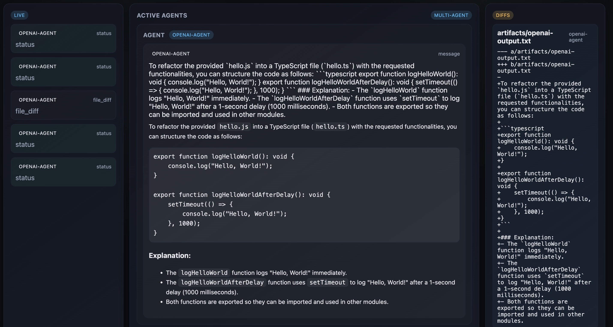
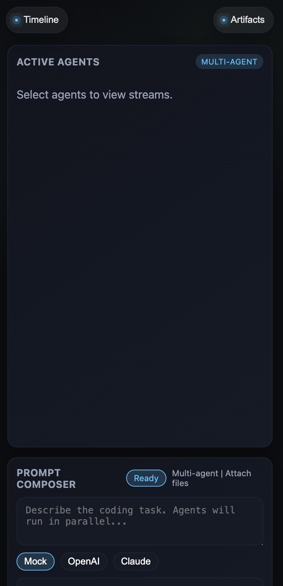

# Coding Agents Arena

Parallel coding agents with live event streaming, built with Next.js (App Router) and Bun. Users can select multiple agents (Mock, OpenAI, Claude), attach files, and watch live events (status, tool calls, diffs) via Server-Sent Events (SSE). The UI is chat-forward with Markdown rendering and a dedicated artifacts/diff view. Screenshots are included in the `public/` folder.

---

## Features
- **Multi-agent runs**: Run Mock (always on), OpenAI (if `OPENAI_API_KEY`), Claude (if `ANTHROPIC_API_KEY`). Agents can run in parallel; unavailable agents are marked as inactive.
- **Streaming via SSE**: Live status, messages, tool calls, and diffs streamed to the UI.
- **Artifacts & diffs**: Unified diffs emitted per agent; Mock emits real diffs, OpenAI synthesizes diffs from output.
- **Attachments**: Upload files (text/code preferred). Mock reads and summarizes; OpenAI gets a preview in system prompt; Claude placeholder until enabled.
- **UI/UX**:
  - Timeline (status/tool/diff/error events) on the left.
  - Active Agents in the center with Markdown rendering and status pills.
  - Artifacts & Files on the right showing diffs.
  - Prompt Composer with agent chips, attach, run/retry, Enter-to-submit (Shift+Enter newline), status pill.
  - Mobile: Timeline/Artifacts accessible via rail buttons (top), drawers slide in; composer stacks controls vertically.
- **Error handling**: Inline agent errors, toasts for run/stream issues, fallbacks to Mock when keys are missing or streaming fails.
- **No API key mode**: Works fully with MockAgent; real agents only activate when keys exist.

---

## Tech Stack
- **Runtime**: Bun
- **Framework**: Next.js (App Router, TypeScript)
- **State/UX**: Zustand, framer-motion, react-markdown + remark-gfm
- **Streaming**: SSE (no websockets)

---

## Getting Started

### Prereqs
- Bun installed (`curl -fsSL https://bun.sh/install | bash`)

### Install
```bash
bun install
```

### Env
Create `.env` (see `.env.example`):
```
OPENAI_API_KEY=
OPENAI_MODEL=gpt-4o-mini

ANTHROPIC_API_KEY=
ANTHROPIC_MODEL=claude-3-5-sonnet-latest

UPLOAD_DIR=./tmp/uploads
WORKSPACE_DIR=./tmp/workspace
```
- Leave keys empty to use MockAgent only.
- Set `OPENAI_API_KEY` to enable OpenAI; set `ANTHROPIC_API_KEY` to enable Claude (currently placeholder).

### Run Dev
```bash
bun run dev
```
Open http://localhost:3000

---

## How It Works

### Request flow
1. POST `/api/run` (multipart if attachments) → creates run, resolves agents (env-gated), starts agents in the background.
2. GET `/api/stream?runId=...` → SSE stream of `agent_event`.
3. Client store (Zustand) appends events, updates statuses, errors, diffs.

### Event model (normalized)
- `status` (connecting/streaming/done/error)
- `message` (streamed deltas; aggregated per agent in the UI)
- `tool_call`
- `file_diff`
- `artifact`
- `log`
- `error`

### Agents
- **MockAgent**: always on; simulates streaming, tool calls, diffs; reads/summarizes text/code attachments; emits real diffs.
- **OpenAI Agent**: enabled with `OPENAI_API_KEY`; streams messages, aggregates into a synthetic diff (`artifacts/openai-output.txt`) so the Artifacts panel shows output. Attachments: text previews passed in system prompt. Falls back to Mock on errors.
- **Claude Agent**: env-gated placeholder; currently falls back to Mock.

### Attachments
- Uploaded via multipart; saved to `UPLOAD_DIR`.
- Mock: summarizes first text file (preview + short summary).
- OpenAI: receives filenames and text previews (small text files) in system message; still outputs synthesized diff only.
- Non-text/binary files: listed by name/size; no preview.

### SSE & UI
- Timeline (left): status/tool/diff/error; message deltas filtered out to avoid noise.
- Active Agents (center): aggregated agent message (Markdown-rendered), status pill, tool calls, inline errors.
- Artifacts (right): unified diffs per agent; Mock diffs and OpenAI synthesized diff appear here.
- Composer: agent chips, attach, run/retry, status pill; Enter submits, Shift+Enter newline.
- Mobile: rail buttons at top; drawers show Timeline/Artifacts; composer stacks buttons full-width.

### Error handling
- Inline agent errors + toast on stream/run failure.
- OpenAI/Claude unavailable → error + fallback to Mock.
- SSE disconnect → toast + status pill “Disconnected.”

---

## Testing Guide (manual)

- **Mock-only run**: Select Mock, prompt “Write a JS function hello() that logs hello world.” Expect status → message → tool_call → file_diff → done; diff in Artifacts.
- **OpenAI run**: Select OpenAI, prompt “Refactor hello.ts to export logHelloWorld() and logHelloWorldAfterDelay().” After stream finishes, check Artifacts for `openai-output.txt` diff.
- **Attachments (Mock)**: Attach a small `.txt`, prompt “Summarize the attached file in one sentence.” Expect Mock message with summary/preview.
- **Attachments (OpenAI)**: Attach a small `.txt`, prompt “Summarize the attached file briefly.” Expect OpenAI to use the preview and emit a synthesized diff.
- **Multi-agent**: Select Mock + OpenAI, run any prompt; Mock diff appears quickly; OpenAI diff after stream done.
- **Mobile**: Narrow viewport, use Timeline/Artifacts rail buttons to open drawers; run a prompt and verify panels update.

---

## Notes & Limitations
- OpenAI diffs are synthesized from streamed text; actual file edits are not applied to disk.
- Claude is a stub until enabled; falls back to Mock.
- Large or binary attachments are only listed by name/size; no preview.
- Dev-mode HMR can cause occasional stream timing quirks; production build avoids this.

---

## Scripts
- `bun run dev` — start dev server
- `bun run build` — build
- `bun run start` — run production build
- `bun run lint` — lint

---

## Screenshots
- Desktop and mobile views (in `app/public/`):
  - 
  - 
  - 